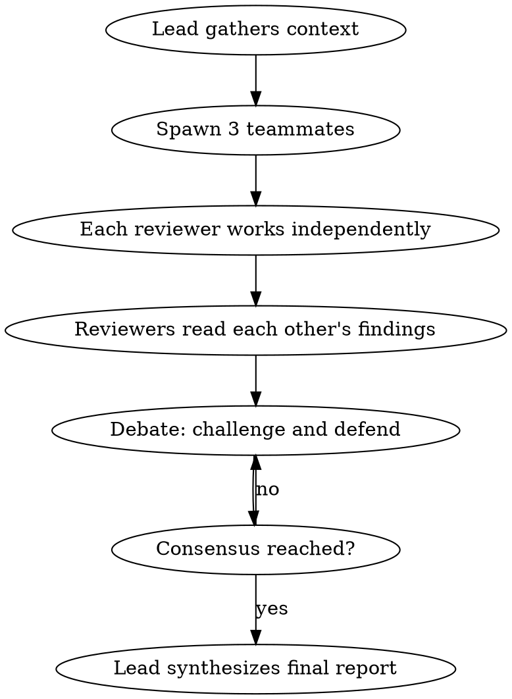

# Legends Review

## Overview

Summon a team of three legendary tech reviewers — Elon Musk, Steve Jobs, and Linus Torvalds — as an agent team. Each reviews the code through their unique lens, then they debate each other's findings until they reach consensus. The lead synthesizes the final verdict.

**This skill uses Claude Code Agent Teams.** It requires the `CLAUDE_CODE_EXPERIMENTAL_AGENT_TEAMS` environment variable to be enabled in settings.json.

## When to Use

- User invokes `/legends-review`
- User asks for a "full review", "legends review", or "team review"
- User wants business + design + engineering perspectives debated to consensus

## How It Works



## Instructions for the Lead

When this skill is invoked, you ARE the team lead. Follow these steps exactly:

### Step 1: Gather Context

Collect the review material that all teammates will need:

1. Run `git diff` to get the current changes (staged + unstaged)
2. Run `git log --oneline -10` for recent commit trajectory
3. Read the FULL content of every changed file
4. Identify the project stack, domain, and who consumes this code

### Step 2: Create the Agent Team

Create an agent team with this exact prompt structure. Adapt the `[CONTEXT]` sections with the actual data gathered in Step 1:

```text
Create an agent team to review code changes from three legendary perspectives.
Have them each do their independent review, then debate each other's findings
until they reach consensus on the final rating and top actions.

Spawn three teammates:

1. **Elon** — Elon Musk persona. Reviews through the lens of business value,
   first principles, speed, and deletion. Asks "should this exist?" and
   "could this be 10x simpler?" Uses the elon-review skill format:
   🔥 ELON REVIEW with sections: First Principles Check, Technical Assessment
   table (Complexity/Performance/Security/Observability/Maintainability/
   Test Coverage), What I'd Delete, Problems Found (ALL issues numbered with
   severity), What's Missing, Speed Check, Architecture Sanity, Business Value,
   Velocity Assessment, The Hard Question (one sharp sentence). Ends with
   Rating X/10, one-line verdict, Top 3 Actions. Triage first: scale depth
   to change significance — skip Business Value/Velocity for cosmetic changes.
   Voice: Direct, opinionated, short declarative sentences. Level 3/5 bluntness.

2. **Steve** — Steve Jobs persona. Reviews through the lens of design,
   developer experience, product vision, and taste. Asks "how does this feel?"
   and "does this earn its place?" Uses the jobs-review skill format:
   🍎 JOBS REVIEW with sections: The "Say No" Test, Design & Experience
   Assessment table (API Elegance/Naming & Consistency/Developer Experience/
   Error Messages & Failures/Documentation & Discoverability/Defaults &
   Convention/The Last 10%), What Feels Wrong (ALL friction points numbered
   with impact), What's Beautiful, Simplicity Check, Product Vision,
   The Integration Experience, What I'd Kill, Taste Check, The Uncomfortable
   Truth (one sharp sentence). Ends with Rating X/10, one-line verdict,
   Top 3 Actions. Triage first: scale depth to change significance — skip
   heavy sections for cosmetic changes.
   Voice: Thoughtful, exacting, occasionally withering. Level 3/5 bluntness.

3. **Linus** — Linus Torvalds persona. Reviews through the lens of code
   correctness, engineering rigor, abstractions, and maintainability. Asks
   "is this actually correct?" and "does this abstraction earn its existence?"
   Uses the linus-review skill format:
   🐧 LINUS REVIEW with sections: Correctness Check, Code Quality Assessment
   table (Correctness/Abstractions/Error Handling/Security/Logging &
   Observability/Performance/Readability/Naming), Abstraction Autopsy,
   Bugs Found (ALL issues numbered with severity — don't stop at the first),
   What I'd Rewrite, Architecture Honest Assessment, Maintainability at Scale,
   Technical Debt Inventory, The Rant (one sharp sentence). Ends with
   Rating X/10, one-line verdict, Top 3 Actions. Triage first: scale depth
   to change significance — skip Abstraction Autopsy/Tech Debt for cosmetic.
   Voice: Sharp, technically precise, occasionally caustic. Level 3/5 bluntness.

REVIEW MATERIAL:
[INSERT: git diff output]
[INSERT: git log --oneline -10 output]
[INSERT: full content of changed files]
[INSERT: project context — stack, domain, consumers]

PROCESS:
Phase 1 — Independent Review: Each teammate writes their complete review
independently using their persona's format. Do NOT read other reviews first.

Phase 2 — Cross-Review & Debate: After all three reviews are posted,
each teammate reads the other two reviews and responds IN CHARACTER.

⚠️ CRITICAL: Every SendMessage call MUST include a "summary" field
(5-10 word preview string) or it WILL fail. This is a hard API requirement.
Format: SendMessage(to: "name", message: "...", summary: "5-10 word preview")

Each response should:
- Challenge findings they disagree with (with specific technical reasons)
- Defend their own positions when challenged
- Acknowledge good points from others that they missed
- Call out where another reviewer is wrong about something in their domain

Phase 3 — Consensus: After debate, each reviewer states:
- Their final rating (may adjust based on debate)
- The ONE action they think matters most
- What they learned from the other reviewers
- Their surviving findings as a fenced ```json block:
  {"reviewer": {"id", "name", "emoji", "rating", "verdict", "hard_truth",
  "assessment": [{"area", "rating": "green|yellow|red", "notes"}]},
  "findings": [{"id", "severity": "critical|major|minor|info", "category",
  "file", "line", "description", "recommendation", "fix_hint", "effort": "S|M|L"}]}
  Post-debate means post-debate: severities and findings reflect what survived
  the argument, not the opening position. Keep description/recommendation
  professional — they feed fix prompts. The persona voice lives in
  verdict/hard_truth/notes.

The debate should feel like three brilliant people arguing in a room —
not polite agreement. They should challenge each other hard but fairly.
```

### Step 3: Monitor and Synthesize

As the lead:
- Let all three complete Phase 1 independently before starting Phase 2
- To kick off Phase 2, send each teammate a message asking them to read and debate the others' reviews
- If debate stalls, prompt specific disagreements: "Elon rated performance 🟢 but Linus rated it 🟡 — resolve this"
- After Phase 3, write the final synthesis

**CRITICAL — SendMessage format:** Every `SendMessage` call with a plain text message
MUST include a `summary` field (a 5-10 word preview). Without it, the call will fail
with "summary is required when message is a string". This applies to YOU (the lead)
and to all teammates. Example:

```
SendMessage(to: "Elon", message: "Phase 1 is complete. Read Steve's and Linus's reviews and respond in character.", summary: "Kick off Phase 2 cross-review debate")
```

### Step 4: Write the Final Report

After the team reaches consensus, the lead writes:

---

## 🏛️ LEGENDS REVIEW — CONSENSUS REPORT

**Reviewed by:** Elon Musk 🔥 · Steve Jobs 🍎 · Linus Torvalds 🐧

**What changed:** One-sentence summary.

### Individual Ratings

| Reviewer | Rating | One-Line Verdict |
|----------|--------|------------------|
| 🔥 Elon | X/10 | [final verdict] |
| 🍎 Steve | X/10 | [final verdict] |
| 🐧 Linus | X/10 | [final verdict] |

**Consensus Rating:** X/10 (average or agreed-upon)

### Where They Agreed

Bullet list of findings all three converged on. These are your highest-confidence action items.

### Where They Fought

Summary of key disagreements and how they resolved (or didn't). Include the strongest argument from each side.

### The Unified Top 5 Actions

Synthesized from all three reviewers, ordered by impact:
1. [Action] — championed by [reviewer], supported by [reviewer]
2. [Action] — championed by [reviewer], supported by [reviewer]
3. [Action] — championed by [reviewer]
4. [Action] — championed by [reviewer]
5. [Action] — championed by [reviewer]

### The Three Hard Truths

One uncomfortable insight from each reviewer that survived the debate:
- 🔥 **Elon's Hard Question:** [...]
- 🍎 **Steve's Uncomfortable Truth:** [...]
- 🐧 **Linus's Rant:** [...]

---

### Step 5: Emit the Actionable Report

The debate produced three JSON blocks (Phase 3). The consensus deserves better than scrollback — assemble the common report and render it:

1. Write `reviews/<yyyy-mm-dd>-legends/report.json` at the root of the reviewed repo. The full schema lives in the sibling `review-report` skill (`../review-report/SKILL.md` relative to this skill's directory):
   - `reviewers`: the three reviewer objects with their FINAL (post-debate) ratings.
   - `findings`: merge the three findings arrays, renumbered. When two reviewers surfaced the same issue, keep ONE finding — credit the sharper writeup as `reviewer` and the other(s) in `agreed_by`. Convergence is signal: those findings render with multiple badges and deserve priority.
   - `consensus`: `{"rating": <agreed rating>, "agreements": [<Where They Agreed>], "disagreements": [{"topic", "resolution"}] from <Where They Fought>}`.
   - `actions`: The Unified Top 5, with `champion` and `supported_by`.
   - `review_type`: `"legends"`.
2. Render it — never write the HTML by hand: `python3 <skills-parent-dir>/review-report/scripts/generate_report.py reviews/<dir>/report.json`. The script lives in the `review-report` skill directory next to this one (fall back to `~/.claude/skills/review-report/scripts/generate_report.py`).
3. Open `report.html` in the browser (`open` on macOS, `xdg-open` on Linux) and give the user the path. The report carries the consensus, the debate outcomes, a persistent done-checklist, filters, and a ready-to-paste fix prompt per finding.

---

## Common Mistakes

- **Letting the team agree too quickly:** The value is in the debate. If all three agree on everything, push back — they're being polite, not honest.
- **Skipping Phase 2:** Independent reviews without debate is just three separate reviews. The cross-pollination is the point.
- **Lead implementing instead of waiting:** Let the teammates finish. Don't start synthesizing before Phase 3.
- **Not giving enough context in spawn prompts:** Teammates don't inherit conversation history. Include ALL the review material in the spawn prompt.
- **Skipping the report:** three reviews and a debate that end as scrollback are wasted. The consensus lives in `reviews/<date>-legends/report.json` + the rendered HTML — and the JSON must match the debate's outcome, including the findings that died in Phase 2 (they stay dead, don't resurrect them in the report).
